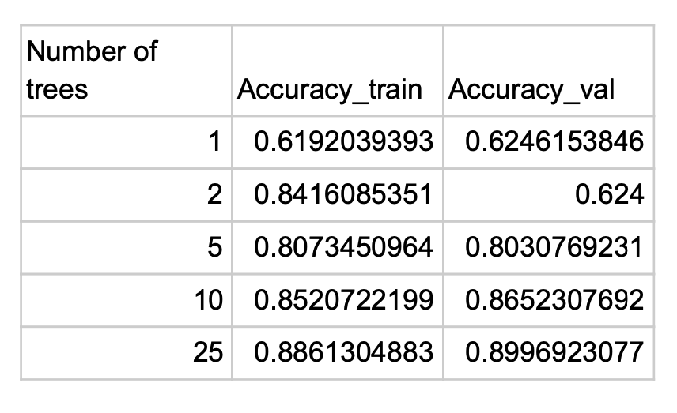
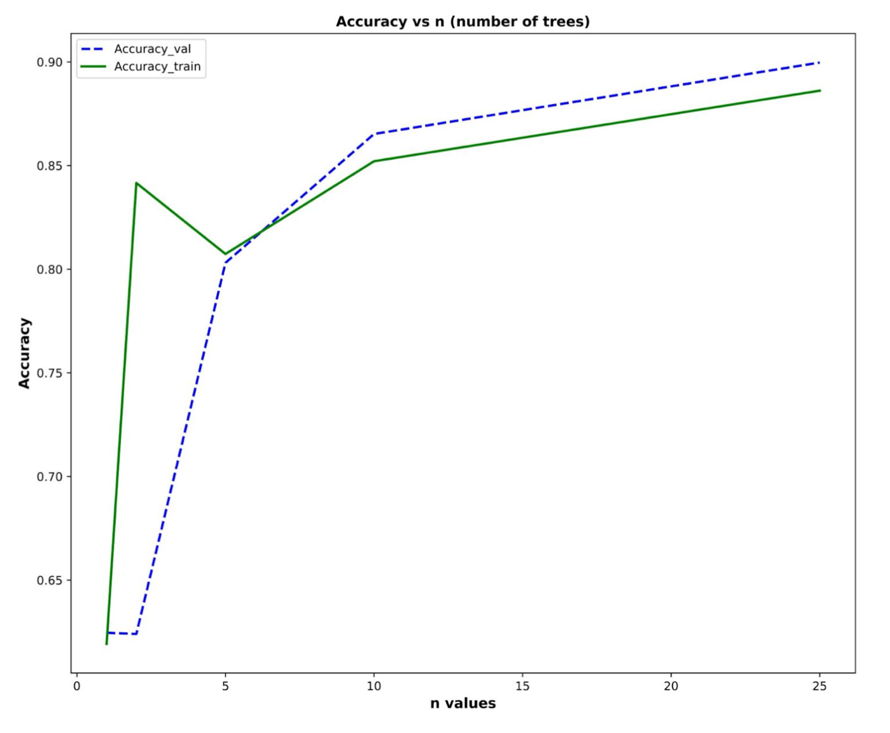
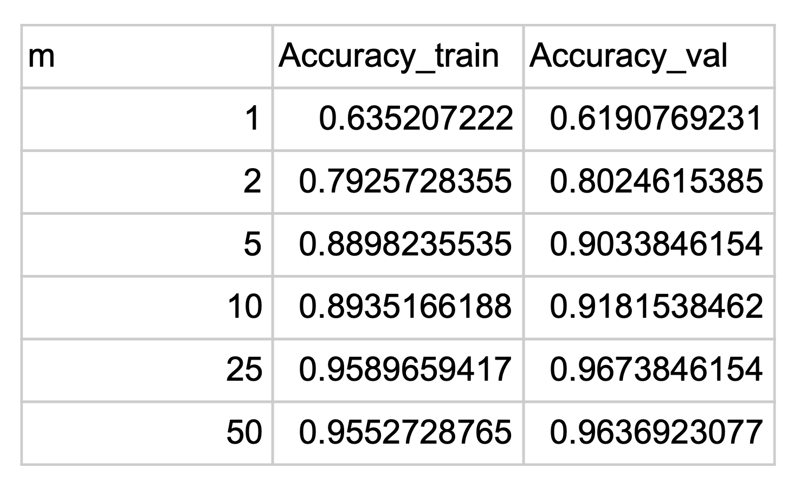
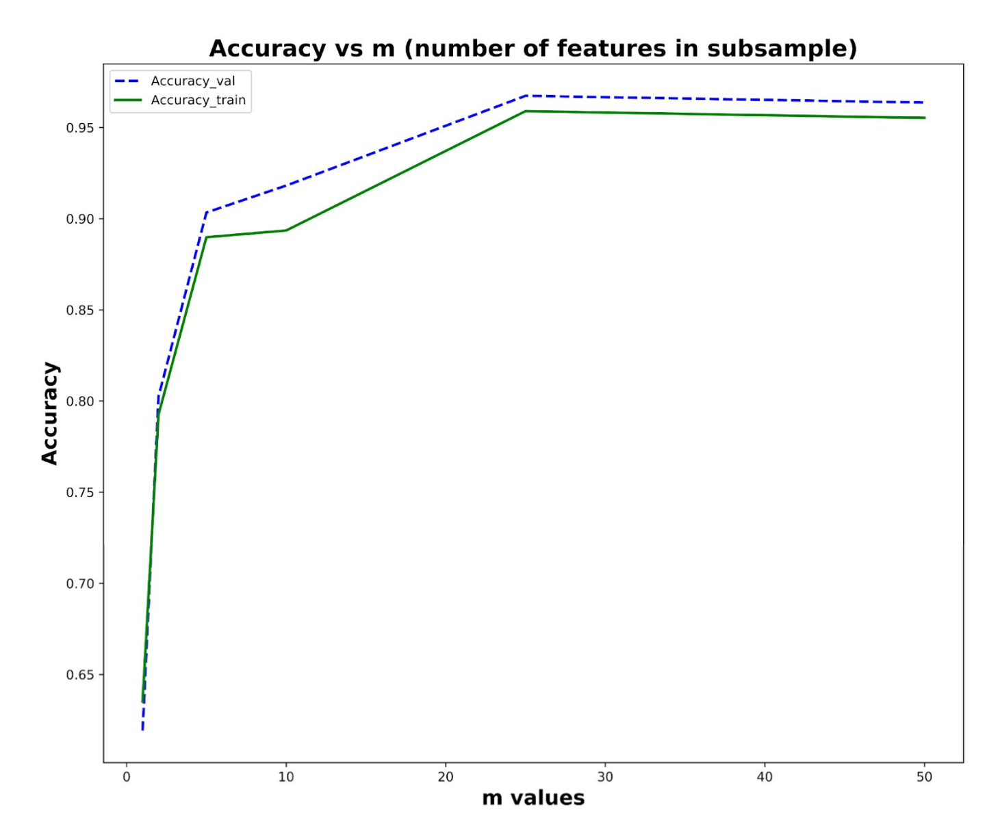
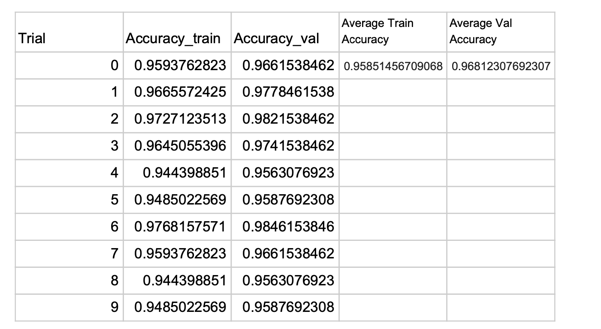
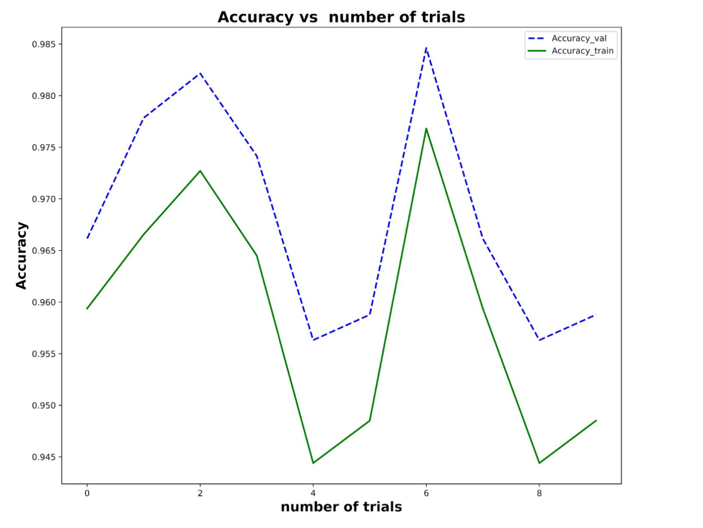
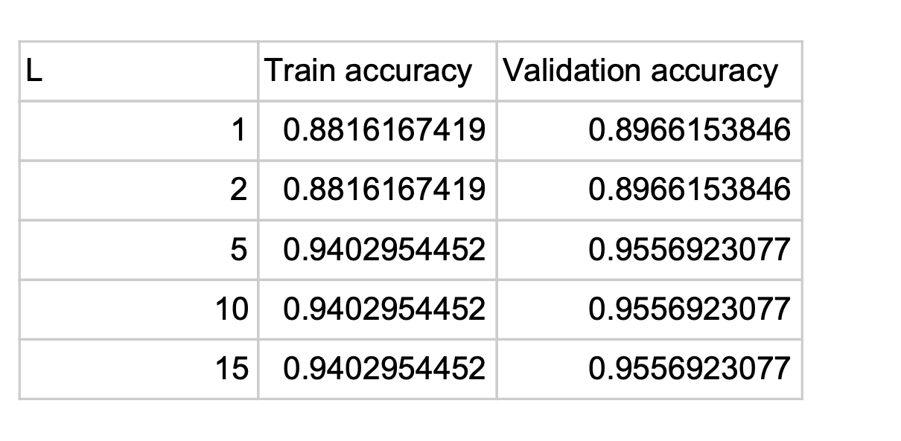
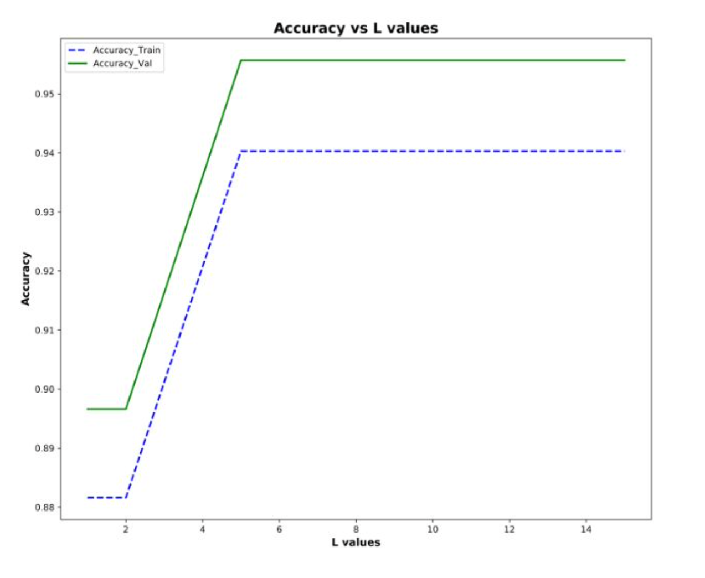

# Mushroom Classification

---

## Content

- [Objective](#obj)
- [Data Summary and Preprocessing](#data)
- [1. Decision Tree](#dtree)
- [2. Random Forest](#randforest)
- [3. Adaboost Algorithm](#adaboost)
- [Conclusion](#conclusion)

<a name="obj">
<b style="font-size:20px">
Objective
</b></a>

The objective of the project is to classify mushrooms into edible and poisonous categories
using:

1. Decision Tree 
2. Random Forest 
3. Adaboost

 <a name="data"><b style="font-size:20px">
Data Summary and Preprocessing
</b></a>

The data is taken directly from the commonly used UCI Machine Learning
Repository. [link](https://archive.ics.uci.edu/ml/datasets/mushroom)

Here is a short description of each train and validation split:

1. Train Set (pa3 train.csv): Includes 4874 rows (samples). Each sample contains the class (poisonous
or edible) with 22 categorical features (split into one-hot vectors for total of 117 features) related to
the mushroom’s properties.

2. Validation Set (pa3 val.csv): Includes 1625 rows. Each row obeys the same format given for the
train set. This set will be used to see the performance of the models.

<a name="dtree"><b style="font-size:20px">
1: Decision Tree 
</b></a>

First, the tree was made with a depth of 2 which was used as a baseline to determine accuracy. 
The depth 2 tree had a training accuracy of 0.953 and a validation accuracy of 0.964. 
Interestingly, the validation accuracy was higher than the training accuracy, 
and this was observed as depths increased as well. One explanation for this is that the 
validation data is cleaner, and may be easier to classify whereas the training data by 
comparison may have been more difficult to create a model with.  
Unsurprisingly, the accuracy for both train and validation improved as the depth of the 
tree increased. This is because a decision tree with more splits is able to classify more 
accurately based on the principle of measuring similarities with more features. 
After depth 5, 100% accuracy was obtained on training and validation data. Therefore,
in the interest of keeping the trees as small as possible, 
depth 6 was determined to be the best for accuracy.

<a name="randforest"><b style="font-size:20px">
2: Random Forest 
</b></a>

For this section, the random forest implementation was used to 
create the trees and make predictions. Depth was held constant at 
2 for all aspects of the random forest, but the number of 
trees n and the number of random feature samples m varied. 
First, for m=5 and n being in the set of [1,2,5,10,25], 
the following results in Table and Figure were obtained:

As expected, increasing the number of trees in the forest did also increase
the train/validation data accuracy. However, the overall curve for the 
training data accuracy does not completely fit the expectation for how the 
accuracy should be increasing; increasing the number of trees should 
logarithmically increase the accuracy, which is seen in the validation curve. 
Fundamentally this is because more trees correspond to more votes, 
and a greater probability of the majority vote being more accurate. 
This logarithmic curve is observed for n = 5 or greater for training accuracy. 
At n = 2 there was a major disconnect between the training and validation accuracy,
and this is most likely caused by the fact that having a forest 
made of 2 trees each with equal vote could more easily result 
in a “bad” tree having half of the say in the overall prediction. However, 
as a whole, adding more trees did correspond with a positive correlation to accuracy.
Additionally, the number of random feature samples, m, 
was also varied while the number of trees was kept constant (n = 15). 

As expected, increasing the number of random features produces higher 
accuracy for both training and validation. The reason for this is because, 
unlike how increasing the number of trees reduces the variance, m is 
ultimately a hyperparameter that reduces the bias by decorrelating the 
trees in the forest. If m is higher, there are more features to randomly 
subsample from each split, and this means that the resultant trees have 
higher probability of being decorrelated from one-another. Reducing the 
correlation between the trees ultimately lowers the bias since individually 
biased trees aren’t as likely to be replicated.
Finally, the best resultant forest was selected to run for 10 trials. 
The results are shown in Table and Figure 
(Training/Validation Accuracy per Trial for n = 25, depth = 2, m = 50):

 the peak validation accuracy in the 10 trials was found to be 98.46% with 
 the average as 96.81%. Randomness does affect the performance because, as 
 seen by the fluctuations, the determined accuracy can vary depending on the
 selection of the initial seed. However, since the number of trees reduces
 the variance, increasing the number of trees should dilute the effect of 
 selecting a different initial seed every time. As a whole, the process
 can be dependent on seeds through its sampling.

<a name="adaboost"><b style="font-size:20px">
3: Adaboost Algorithm
</b></a>

Finally, the Adaboost algorithm was implemented as a way to make 
classifications. Using decision stumps (depth = 1) and varying values of 
L of [1,2,5,10,15], or the number of base classifiers, the following data 
was obtained which is shown in Table

Increasing the L-value has a positive effect on both training and 
validation accuracy. This falls in line with expectations because
the purpose of Adaboost is to use several weak learners, or classifiers 
that perform at least as well as random guessing, in order to ultimately 
produce a strong classifier. Since this implementation uses decision stumps,
and each subsequent decision stump learns from the error of the previous 
stump, it follows that increasing the number of base classifiers should 
result in increased accuracy for both training and validation data.
Another version of Adaboost was also ran, this time with a tree depth 
of 2 and an L value of 6. The training accuracy was found to be 97.56% and 
the validation accuracy 98.22%. This version outperformed even 15 base 
classifiers with a depth of 1 in the previous run. The reason for this is 
likely that a decision tree of depth 2 can make better predictions than
a decision tree of depth 1. It is still technically a weak learner, 
but not as weak as a depth 1 tree. Therefore, the error on each iteration 
with trees of depth 2 will be less relative to any iteration with depth 1, 
and thus accuracy will be higher.

<a name="conclusion"><b style="font-size:20px">
Conclusion
</b></a>

1.For random forest, increasing the number of trees in the forest did 
improve the train/validation data accuracy, however increasing 
the number of trees should follow logarithmically increase the accuracy.

2. increasing the number of random features produces higher accuracy 
   for both training and validation.
   

